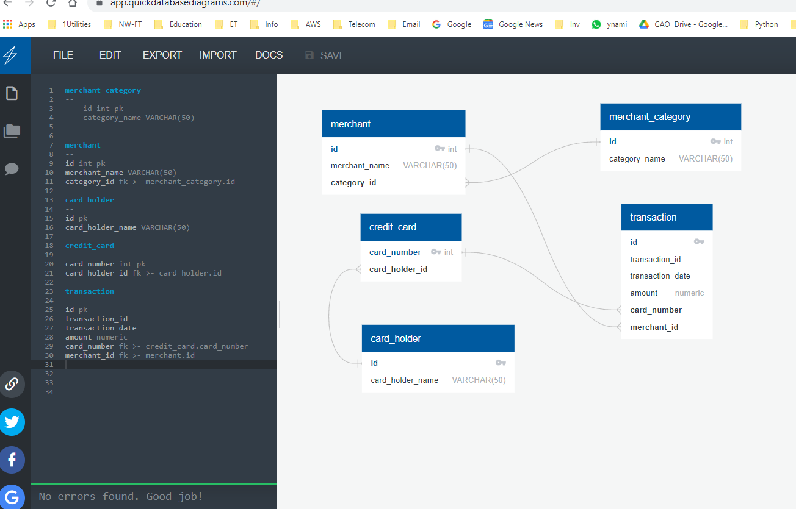
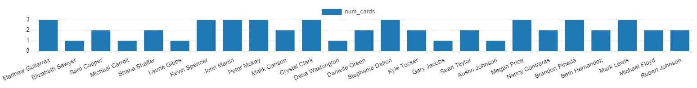
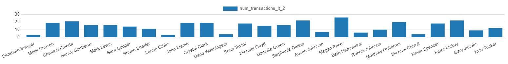
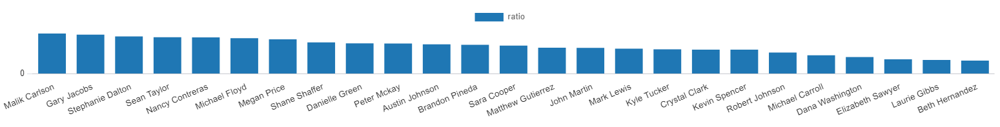
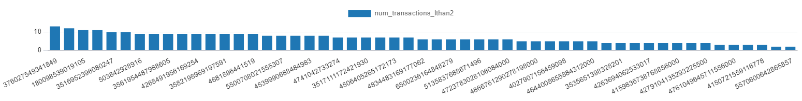

# Unit 7 Homework Submission: Looking for Suspicious Transactions

## Activities Performed

1. [Data Modeling](#Data-Modeling):
Define a database model to store the credit card transactions data and create a new PostgreSQL database using your model.

2. [Data Engineering](#Data-Engineering): Create a database schema on PostgreSQL and populate your  database from the CSV files provided.

3. [Data Analysis](#Data-Analysis): Analyze the data to identify possible fraudulent transactions trends data, and develop a report of your observations.

---

## Files used

* [card_holder.csv](Data/card_holder.csv)
* [credit_card.csv](Data/credit_card.csv)
* [merchant.csv](Data/merchant.csv)
* [merchant_category.csv](Data/merchant_category.csv)
* [transaction.csv](Data/transaction.csv)

## 

### Data Modeling

Create an entity relationship diagram (ERD) by inspecting the provided CSV files.

Part of the challenge here is to figure out how many tables you should create, as well as what kind of relationships you need to define among the tables.

Feel free to discuss your database model design ideas with your classmates. You can use a tool like [Quick Database Diagrams](https://www.quickdatabasediagrams.com) to create your model.

## Response

URL with ERD is at:

https://app.quickdatabasediagrams.com/#/d/D2S8vH

### Data Engineering

Using your database model as a blueprint, create a database schema for each of your tables and relationships. Remember to specify data types, primary keys, foreign keys, and any other constraints you defined.

**After creating the database schema, import the data from the corresponding CSV files.**

**schema.sql** 

-- DATA MODELING and DATA ENGINEERING

-- create creditcard_db in pgAdmin
-- after some experiementation drop tables to start afresh

DROP TABLE IF EXISTS card_holder CASCADE;
DROP TABLE IF EXISTS credit_card CASCADE;
DROP TABLE IF EXISTS merchant CASCADE;
DROP TABLE IF EXISTS merchant_category CASCADE;
DROP TABLE IF EXISTS transaction CASCADE;
--- create 5 tables with Primary and Foreign Keys as below

-- SQL file schema
CREATE TABLE merchant_category (
    id SERIAL PRIMARY KEY,
    category_name VARCHAR(50) NOT NULL
);

CREATE TABLE merchant (
    id SERIAL PRIMARY KEY,
    merchant_name VARCHAR(50) NOT NULL,
    category_id INTEGER NOT NULL,
    FOREIGN KEY (category_id) REFERENCES merchant_category(id)
);

CREATE TABLE card_holder (
    id SERIAL PRIMARY KEY,
    card_holder_name VARCHAR(50) NOT NULL
);

CREATE TABLE credit_card (
    card_number BIGINT PRIMARY KEY,
    card_holder_id INTEGER NOT NULL,
    FOREIGN KEY (card_holder_id) REFERENCES card_holder(id)
);

CREATE TABLE transaction (
  id SERIAL PRIMARY KEY,
  transaction_id INTEGER NOT NULL,
  transaction_date TIMESTAMP NOT NULL,
  amount NUMERIC(10,2) NOT NULL,
  card_number BIGINT,
  merchant_id INTEGER,
  FOREIGN KEY (card_number) REFERENCES credit_card (card_number),
  FOREIGN KEY (merchant_id) REFERENCES merchant (id)
);

-**- updated the seed file to make this change to fix error**

**-- INSERT INTO transaction (transaction_id, transaction_date, amount, card_number, merchant_id) VALUES**

**-- read seed data file**

### Data Analysis
#### Part 1:

The CFO of your firm has requested a report to help analyze potential fraudulent transactions. Using your newly created database, generate queries that will discover the information needed to answer the following questions, then use your repository's ReadME file to create a markdown report you can share with the CFO:

* Some fraudsters hack a credit card by making several small transactions (generally less than $2.00), which are typically ignored by cardholders. 

  * How can you isolate (or group) the transactions of each cardholder?
  * Count the transactions that are less than $2.00 per cardholder. 
  * Is there any evidence to suggest that a credit card has been hacked? Explain your rationale.

  

First we identify the number of cards per cardholder. (Using graph visualizer in pgAdmin)

Less than $2 transactions per cardholder:

Do further analysis with ratio of transactions below $2 versus total transactions for a cardholder:

``

Also do a below $2 by card number:

Top 5 cardholders who have maximum number of less than $2 transactions:

**From above analysis there is pattern that some card members and cards have much higher number of below $2 transactions leading one to consider there is fraud going on that needs further investigation.**

Take your investigation a step further by considering the time period in which potentially fraudulent transactions are made. 

* What are the top 100 highest transactions made between 7:00 am and 9:00 am?

* Do you see any anomalous transactions that could be fraudulent?

* Is there a higher number of fraudulent transactions made during this time frame versus the rest of the day?

* If you answered yes to the previous question, explain why you think there might be fraudulent transactions during this time frame.

* What are the top 5 merchants prone to being hacked using small transactions?

* Create a view for each of your queries.

First we see the transactions with less than $2 and merchants:

**There is no major pattern that can be seen above.**

Then we find merchants who have maximum transactions for less than $2 from 7-9am timeframe:

From this 7 merchants Greene-Wood, Clark and Sons, Baker Inc, Wilson and Wood-Ramirez, Atkinson and Pugh-Williams have at least 2 transactions of this type. While rest have 1. 

We look at merchant category for transactions of less than $2 from 7-9am:

**From these it appears that bar and pub transactions are suspicious for 7-9am. Hence the merchants Greene-Wood, Wood-Ramirez, Atkinson Ltd and Pugh-Williams are top merchants/places were fraud is likely to be committed.**

#### Part 2: 

Your CFO has also requested detailed trends data on specific card holders. Use the [starter notebook](Starter_Files/challenge.ipynb) to query your database and generate visualizations that supply the requested information as follows, then add your visualizations and observations to your markdown report:      

* The two most important customers of the firm may have been hacked. Verify if there are any fraudulent transactions in their history. For privacy reasons, you only know that their cardholder IDs are 2 and 18.

  * Using hvPlot, create a line plot representing the time series of transactions over the course of the year for each cardholder separately. 
  
  * Next, to better compare their patterns, create a single line plot that contains both card holders' trend data.  

  * What difference do you observe between the consumption patterns? Does the difference suggest a fraudulent transaction? Explain your rationale.

* The CEO of the biggest customer of the firm suspects that someone has used her corporate credit card without authorization in the first quarter of 2018 to pay quite expensive restaurant bills. Again, for privacy reasons, you know only that the cardholder ID in question is 25.

  * Using hvPlot, create a box plot, representing the expenditure data from January 2018 to June 2018 for cardholder ID 25.
  
  * Are there any outliers for cardholder ID 25? How many outliers are there per month?

  * Do you notice any anomalies? Describe your observations and conclusions.

**Response: see in file RVGchallenge.ipynb**

### Challenge

Another approach to identifying fraudulent transactions is to look for outliers in the data. Standard deviation or quartiles are often used to detect outliers.

Use the [challenge starter notebook](Starter_Files/challenge.ipynb) to code two Python functions:

* One that uses standard deviation to identify anomalies for any cardholder.

* Another that uses interquartile range to identify anomalies for any cardholder.

For help with outliers detection, read the following articles:

* [How to Calculate Outliers](https://www.wikihow.com/Calculate-Outliers)

* [Removing Outliers Using Standard Deviation in Python](https://www.kdnuggets.com/2017/02/removing-outliers-standard-deviation-python.html)

* [How to Use Statistics to Identify Outliers in Data](https://machinelearningmastery.com/how-to-use-statistics-to-identify-outliers-in-data/)

### Submission

Post a link to your GitHub repository in BootCamp Spot. The following should be included your repo:

* An image file of your ERD.

https://app.quickdatabasediagrams.com/#/d/D2S8vH

* The `.sql` file of your table schemata.

* The `.sql` file of your queries.

* The Jupyter Notebook containing your visual data analysis.

* A ReadME file containing your markdown report.

* **Optional:** The Jupyter Notebook containing the optional challenge assignment.

### Hint

For comparing time and dates, take a look at the [date/time functions and operators](https://www.postgresql.org/docs/8.0/functions-datetime.html) in the PostgreSQL documentation.

---
### Requirements

#### Data Modeling  (20 points)

##### To receive all points, your code must:

* Define a database model. (10 points)
* Use the defined model to create a PostgreSQL database. (10 points)

#### Data Engineering  (20 points)

##### To receive all points, your code must:

* Create a database schema for each table and relationship. (5 points)
* Specify the data types. (5 points)
* Define primary keys. (5 points)
* Define foreign keys. (5 points)

#### Data Analysis  (30 points)

##### To receive all points, your code must:

* Identify fraudulent transactions. (10 points)
* Utilize SQL and Pandas DataFrames for a report within Jupyter Notebook. (10 points)
* Provide a visual data analysis of fraudulent transactions using Pandas, hvPlot, and SQLAlchemy to create the visualizations. (10 points)

#### Coding Conventions and Formatting (10 points)

##### To receive all points, your code must:

* Place imports at the beginning of the file, just after any module comments and docstrings and before module globals and constants. (3 points)
* Name functions and variables with lowercase characters and with words separated by underscores. (2 points)
* Follow Don't Repeat Yourself (DRY) principles by creating maintainable and reusable code. (3 points)
* Use concise logic and creative engineering where possible. (2 points)

#### Deployment and Submission (10 points)

##### To receive all points, you must:

* Submit a link to a GitHub repository that’s cloned to your local machine and contains your files. (5 points)
* Include appropriate commit messages in your files. (5 points)

#### Code Comments (10 points)

##### To receive all points, your code must:

* Be well commented with concise, relevant notes that other developers can understand. (10 points)

---

© 2022 edX Boot Camps LLC. Confidential and Proprietary. All Rights Reserved.

